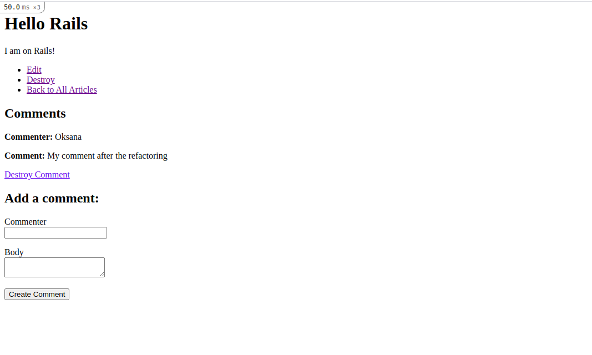

# README
PROJECT: BLOG APP from the OdinProject

https://guides.rubyonrails.org/getting_started.html



## Getting Started

To get a local copy up and running follow these simple example steps.


### Prerequisites

- Ruby v2.7.2
- Ruby on Rails v6.1.1'
- sQlite3

### Setup

Instal gems with:

```
bundle install
```

Setup database with:

```
   rails db:create
   rails db:migrate
```


### Usage

Start server with:

```
    rails server
```

Open `http://localhost:3000/` in your browser.

* ...
## Author

👤 **Oksana Petrova**

- GitHub:[@github/Laguna1](https://github.com/Laguna1)
- Linkedin:[linkedin/OksanaPetrova](https://www.linkedin.com/in/oksana-petrova/)
- Twitter:[@OksanaP48303303](https://twitter.com/OksanaP48303303)

## 🤝 Contributing

Contributions, issues and feature requests are welcome!

Feel free to check the [issues page](issues/).

## Show your support

Give a ⭐️ if you like this project!